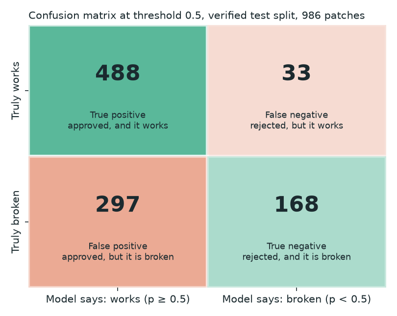
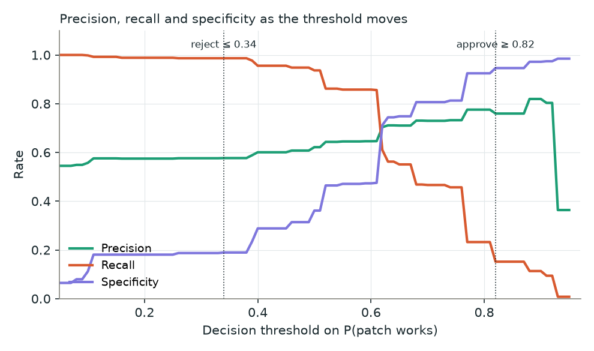
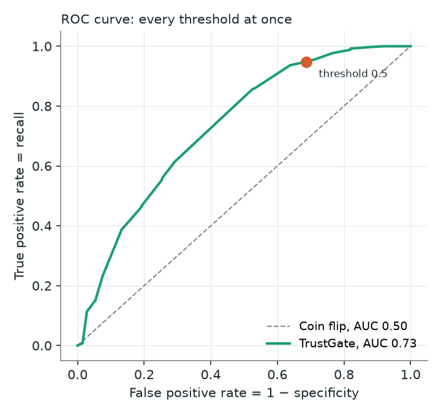
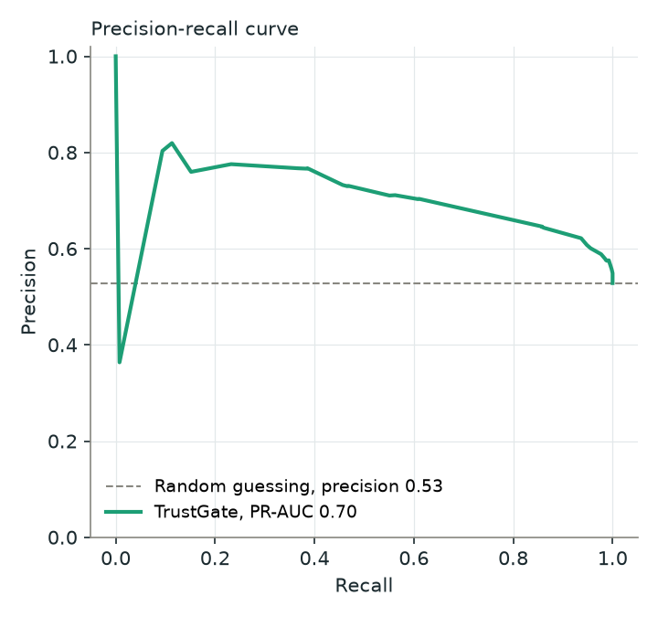
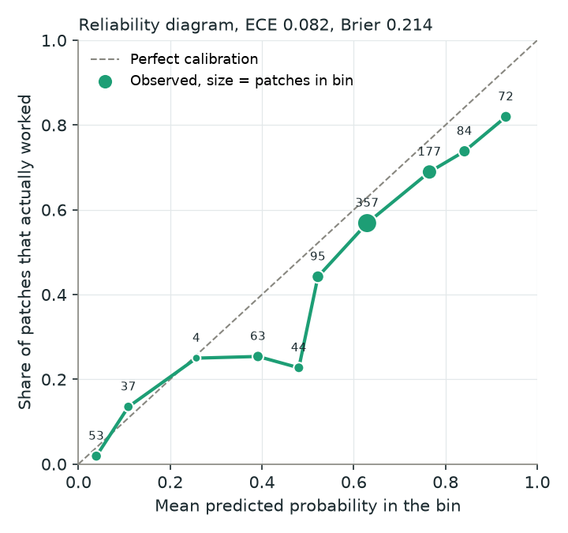
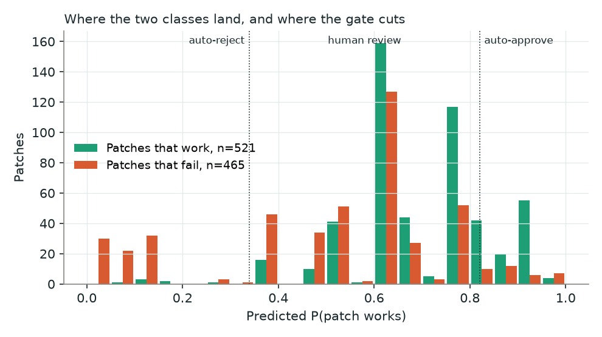

# Evaluation metrics, explained with TrustGate's own numbers

Every figure and number below comes from the exported Verified-split gate
(`models/trustgate_gate_verified.joblib`) scored on the 986 held-out test
patches from 100 bugs the model never saw. 521 of those patches truly work
(label 1) and 465 do not (label 0), so the positive rate is 52.8 percent.
Regenerate the figures with the script in the appendix.

Throughout, "positive" means "the patch works", because that is what the
model predicts. The four cells every metric is built from:

| | Model says: works | Model says: broken |
|---|---|---|
| **Truly works** | True positive (TP) | False negative (FN) |
| **Truly broken** | False positive (FP) | True negative (TN) |

"Positive" and "negative" refer to what the model said; "true" and "false" to
whether it was right. So a false positive is a positive call that was wrong,
and a false negative is a negative call that was wrong.

At the plain 0.5 threshold TrustGate produced:



TP = 488, FN = 33, FP = 297, TN = 168. Keep these four numbers in mind; the
first six metrics are just different ratios of them.

## A toy example to compute by hand

Imagine 100 patches: 60 truly work, 40 are broken. The model says "works" for
50 of them: 45 are right and 5 are broken. So TP = 45, FP = 5, FN = 15, TN = 35.

| Metric | Formula | Toy example | TrustGate at 0.5 |
|---|---|---|---|
| Accuracy | (TP + TN) / all | (45 + 35) / 100 = **0.80** | (488 + 168) / 986 = **0.665** |
| Precision | TP / (TP + FP) | 45 / 50 = **0.90** | 488 / 785 = **0.622** |
| Recall | TP / (TP + FN) | 45 / 60 = **0.75** | 488 / 521 = **0.937** |
| Specificity | TN / (TN + FP) | 35 / 40 = **0.875** | 168 / 465 = **0.361** |
| F1 | 2 · P · R / (P + R) | 2 · 0.9 · 0.75 / 1.65 = **0.818** | 2 · 0.622 · 0.937 / 1.559 = **0.747** |

## Accuracy

**Question it answers.** Of all decisions, how many were correct? The word is
used in its everyday sense: the fraction of verdicts that matched reality.

**Formula.** Accuracy = (TP + TN) / (TP + TN + FP + FN)

**TrustGate.** 0.665. Two thirds of the 986 verdicts were right.

**Why it misleads.** Accuracy has to be read next to the score you get for
free by always guessing the majority class. Here that floor is 0.528, so the
model adds 14 points. On the full 2,294-issue set the floor is 0.667 because
two thirds of patches are broken, and the model's 0.686 accuracy is only two
points above it. Same model quality, very different-looking number. A
fraud model that flags nothing scores 99.9 percent accuracy on data where 0.1
percent of transactions are fraud. Never report accuracy without the floor.

## Precision

**Question it answers.** When the model says "works", how often is it right?
The term comes from information retrieval in the 1960s, where it measured what
share of the documents a search returned were actually relevant. Here the
"search results" are the patches the model approves.

**Formula.** Precision = TP / (TP + FP)

**TrustGate.** 0.622 at the 0.5 threshold. But the gate does not approve at
0.5; it approves at 0.82. Among the 10.5 percent of patches it auto-approved,
76.0 percent truly worked. That 76 percent is the precision of the approve
decision, and it is the single number that decides whether the gate can be
trusted to merge code: every point below 100 is a broken patch merged without
a human looking.

**Practical reading.** If a team auto-approves 100 patches at this precision,
24 of them will not fix their bug. That is why the results deck says the model
is not adequate as an autonomous approver: the bar for that job is 90 to 95.

## Recall

**Question it answers.** Of all the patches that truly work, how many did the
model catch?

**Formula.** Recall = TP / (TP + FN). Also called sensitivity, the name used
in medical diagnostics for how many sick patients a test detects, or true
positive rate (TPR). "Recall" is the information-retrieval name: of all the
relevant documents that exist, how many did the search recall.

**TrustGate.** 0.937 at 0.5. The model finds 488 of the 521 working patches
and misses 33. High recall came at the cost of low precision and specificity:
it says "works" to 785 patches to catch those 488.

**The trade-off.** Precision and recall pull against each other through the
threshold. Raise it and the model approves fewer patches, so precision rises
and recall falls. The sweep below shows the whole trade for TrustGate, with
the two gate thresholds marked.



At the approve threshold of 0.82, precision is up and recall is down to
roughly 15 percent: the gate approves only the patches it is surest about and
lets the rest go to review. At the reject threshold of 0.34, specificity for
the reject decision is what matters, and 92.6 percent of the patches it
rejected were truly broken.

## F1

**Question it answers.** How good is the balance between precision and recall
in one number?

**Where the name comes from.** F1 is a member of the F-measure family, which
descends from the "effectiveness" measure Cornelis van Rijsbergen defined in
his 1979 information-retrieval textbook. The general form is

F<sub>β</sub> = (1 + β²) · Precision · Recall / (β² · Precision + Recall)

where β says how many times more you care about recall than precision. β = 1
weights them equally, hence "F1". β = 2 (F2) favours recall; β = 0.5 favours
precision. The letter F has no deeper meaning; it is simply the label the
measure was given when it was popularised at the MUC-4 evaluation conference
in 1992.

**Formula.** With β = 1 the expression collapses to
F1 = 2 · Precision · Recall / (Precision + Recall). This is the harmonic mean
of the two, which punishes imbalance: a model with precision 1.0 and recall
0.1 has F1 0.18, not the arithmetic mean 0.55.

**TrustGate.** 0.747 at 0.5, driven by the high recall.

**When to use it.** When one threshold has to serve both goals and false
positives and false negatives cost about the same. That is not TrustGate's
situation: a false approval (merged broken code) costs far more than a false
rejection (a good patch waits for a human). So F1 is reported but does not
drive any decision here.

## Specificity

**Question it answers.** Of all the patches that are truly broken, how many
did the model correctly call broken?

**Formula.** Specificity = TN / (TN + FP). Also called true negative rate
(TNR). Like sensitivity, the term comes from medical testing, where it is the
share of healthy patients a test correctly clears. Its complement,
FP / (TN + FP), is the false positive rate (FPR) plotted on the ROC x-axis.

**TrustGate.** 0.361 at 0.5. The model let 297 of 465 broken patches through
as "works". This is the mirror of the high recall: a lenient threshold catches
almost every good patch and also waves through most bad ones.

**For the gate.** The reject decision is a specificity question at the reject
threshold: of patches the model rejects, how many are really broken? 92.6
percent. The reject side is the reliable side of this model.

## ROC-AUC (Receiver Operating Characteristic, Area Under the Curve)

**Question it answers.** If you pick one working patch and one broken patch at
random, how often does the model give the working one the higher score?

**Where the name comes from.** The ROC curve was invented by radar engineers
during the Second World War to describe how well a receiver operator could
tell enemy aircraft from noise as the detection threshold was varied; hence
"receiver operating characteristic". Signal-detection psychology adopted it in
the 1950s and medicine in the 1970s. AUC is simply the area under that curve.

**Formula.** The ROC curve plots the true positive rate (recall) on the y-axis
against the false positive rate (1 − specificity) on the x-axis at every
possible threshold. AUC is the area under it, and it equals the pairwise
probability above. 0.5 is a coin flip, 1.0 is perfect.



**TrustGate.** 0.733, with a 95 percent bootstrap interval of 0.69 to 0.78.
Read it as: hand the model a random good patch and a random bad one, and it
ranks them correctly 73 times out of 100.

**Why it matters.** AUC does not depend on the threshold, so it measures the
model's ranking ability separately from the business decision about where to
cut. That makes it the right number for comparing models and feature sets,
which is how the ablation in section 19.2 is scored. It is also why the
recommendation is to use TrustGate as a prioritizer: ranking is what 0.73
buys you.

**Limitation.** AUC treats the whole curve equally, including regions no one
would operate in. For a gate that only cares about the high-confidence end,
the precision at that end matters more than the area.

## PR-AUC (Precision-Recall, Area Under the Curve)

**Question it answers.** Across all thresholds, how much precision does the
model keep as it tries to recall more of the positives?

**Formula.** The precision-recall curve plots precision against recall at
every threshold. PR-AUC is the area under it. scikit-learn computes it as
average precision (AP), the precision at each recall level weighted by the
recall gained there, which avoids the optimistic interpolation a plain
trapezoid rule would give. A random model scores the positive rate, here
0.528, not 0.5.



**TrustGate.** 0.705 against a random baseline of 0.528.

**When it beats ROC-AUC.** When positives are rare. ROC's x-axis is the false
positive rate, which barely moves when negatives are plentiful, so ROC-AUC can
look excellent while the model floods you with false positives. Precision
feels every false positive directly. On Verified the classes are balanced so
the two agree; on the full set, with 32 percent positives, PR-AUC dropped to
0.51 while ROC-AUC stayed at 0.69, which is the more honest picture of how
much work an approver would create there.

## Brier score

**Question it answers.** How far are the predicted probabilities from what
happened, on average?

**Where the name comes from.** Glenn W. Brier, a meteorologist at the US
Weather Bureau, proposed it in 1950 to score forecasts such as "70 percent
chance of rain". A forecaster who says 70 percent on days it rains 70 percent
of the time is rewarded; one who hedges at 50 percent every day, or shouts 100
percent and is wrong, is penalised. Patch verdicts are forecasts in exactly
that sense.

**Formula.** Brier = mean over patches of (p − y)², where p is the predicted
probability and y is 1 or 0. Lower is better. Predicting 0.9 for a patch that
works costs 0.01; predicting 0.9 for one that fails costs 0.81.

**Worked example.** Four patches with predictions 0.9, 0.7, 0.4, 0.2 and
outcomes 1, 0, 1, 0. Squared errors: 0.01, 0.49, 0.36, 0.04. Brier = 0.225.

**TrustGate.** 0.214. The reference point is a model that predicts the base
rate 0.528 for everything, which scores 0.249. Perfect predictions score 0,
so TrustGate closes about 14 percent of the gap.

**Why it exists.** Accuracy and AUC only care about ordering or about which
side of 0.5 a prediction lands. Brier rewards saying 0.55 rather than 0.95
when you are genuinely unsure, which is exactly the behaviour a three-way
gate depends on.

## Calibration and ECE (Expected Calibration Error)

**Question it answers.** When the model says 0.9, do about 90 percent of those
patches actually work? A model with this property is called calibrated, again
a word borrowed from measuring instruments: a calibrated thermometer reads 20
degrees when it is 20 degrees.

**Method.** Sort predictions into bins, for example 0.0 to 0.1, 0.1 to 0.2 and
so on. In each bin compare the mean predicted probability with the observed
share of working patches. Plot one against the other: a perfectly calibrated
model lies on the diagonal.



**Formula.** ECE = sum over bins of (patches in bin / all patches) ·
|observed rate − mean predicted probability|. "Expected" is used in the
statistical sense of a weighted average: it is the gap from the diagonal you
would expect for a randomly chosen patch. 0 is perfect.

**TrustGate.** ECE 0.082. Reading the diagram: in the 0.6 to 0.7 bin, which
holds 357 patches, the model said 0.63 on average and 57 percent worked.
Reasonably honest. In the 0.9 to 1.0 bin it said 0.93 and 82 percent worked:
the model is over-confident exactly where the approve decision lives. That
11-point gap is another way of seeing why approve precision came in at 76
rather than the 90 the thresholds were tuned for.

**Why the gate needs it.** The three-way policy compares probabilities to
fixed cut-offs. If 0.82 does not mean "82 percent", the cut-off does not mean
what the business thinks it means. Calibration, via the isotonic step in
notebook cell 19.7, is what makes the thresholds interpretable.

## Putting it together: where the classes land



Working patches pile up on the right and broken ones on the left, but the
overlap is large. The two dotted lines are the gate. Everything right of 0.82
is auto-approved: mostly good, but a coral slice of broken patches sits there
too, and that slice is the 24 percent false-approval rate. Everything left of
0.34 is auto-rejected, almost entirely broken. The wide middle, 80 percent of
patches, goes to a human. A better model would push the two colours apart so
the middle shrinks without the tails getting dirtier.

## Glossary of acronyms and terms

| Term | Full form | Origin |
|---|---|---|
| TP, FP, FN, TN | True positive, false positive, false negative, true negative | Signal detection theory; the "positive" is what the model asserted |
| TPR, FPR, TNR | True positive rate, false positive rate, true negative rate | Same; TPR = recall = sensitivity, TNR = specificity, FPR = 1 − specificity |
| Precision, recall | not acronyms | Information retrieval, 1960s: relevant results returned, and relevant results found |
| Sensitivity, specificity | not acronyms | Medical diagnostics: sick patients detected, healthy patients cleared |
| F1, F<sub>β</sub> | F-measure with β = 1 | van Rijsbergen's effectiveness measure, 1979; named F at MUC-4, 1992 |
| ROC | Receiver operating characteristic | Second World War radar engineering |
| AUC | Area under the curve | Generic; here the ROC or PR curve |
| PR | Precision-recall | The curve of precision against recall |
| AP | Average precision | scikit-learn's estimate of PR-AUC |
| Brier score | named after Glenn W. Brier | Weather forecasting, 1950 |
| ECE | Expected calibration error | Calibration literature, popularised for neural networks around 2015 |
| TF-IDF | Term frequency, inverse document frequency | Information retrieval weighting used for the issue-patch similarity feature |
| HGB | Histogram-based gradient boosting | scikit-learn's `HistGradientBoostingClassifier`, the tree model in the notebook |
| CV | Cross-validation | Rotating held-out folds; grouped by issue in this project |
| Ablation | not an acronym | Surgical removal of tissue; in ML, removing a component to measure its contribution |

## Ablation

**Question it answers.** Which parts of the model actually earn their place?
You remove one part, re-measure, and the drop in the score is that part's
contribution.

**Where the name comes from.** In medicine, ablation is the surgical removal
or destruction of tissue. Nineteenth-century physiologists learned what a
brain region did by ablating it in animals and observing what function was
lost. Machine learning borrowed the word around 2010 for the same logic
applied to a system: take a component out, see what breaks. An "ablation
study" is the table of results from doing that systematically.

**Two kinds in this project.**

*Feature-group ablation* (notebook cell 19.2) adds one family of features at a
time and retrains, so each row's gain over the previous one is that family's
contribution. Same issue-grouped split, same seeds, two model types.

| Feature set | Features | Logistic | Gradient boosting |
|---|---|---|---|
| 1. Patch shape | 5 | 0.528 | 0.612 |
| 2. + agreement (`self_consistency`) | 6 | 0.687 | 0.726 |
| 3. + code health (static checks) | 13 | 0.705 | 0.737 |
| 4. + semantic (TF-IDF, issue length) | 16 | 0.724 | 0.734 |

Read down the gradient-boosting column: agreement adds 0.11 of ROC-AUC, code
health adds 0.01, semantic adds nothing. The bootstrap interval on this test
split is about ±0.05, so only the agreement step is a real effect; the other
two are inside the noise.

*Permutation importance* (same cell) is a per-feature ablation that avoids
retraining. Take the trained model, shuffle one feature's column so it carries
no information, re-score the test split, and record how much ROC-AUC fell.
Repeat five times and average. For the best Verified model:

| Feature shuffled | Drop in ROC-AUC |
|---|---|
| `self_consistency` | 0.19 |
| `patch_additions` | 0.04 |
| `patch_files` | 0.03 |
| everything else | under 0.01 each |

**How to read an ablation honestly.**

- Compare differences to the confidence interval, not to zero. A 0.01 gain on
  a ±0.05 interval is not a finding.
- Order matters in the cumulative form. Code health looks worthless after
  agreement is in, but it might have looked useful added first, because the
  two overlap: a patch that agrees with its peers usually also parses. The
  cumulative table answers "what does this add on top of what we already
  have", which is the deployment question.
- Correlated features share credit in permutation importance. Shuffling one
  of two near-duplicate columns costs little because the other covers for it,
  so a low score means "not needed given the others", not "useless".
- Ablation measures contribution to this model on this data. It says nothing
  about whether a feature would matter for a different model class or a
  different label.

**What it decided here.** The ablation is the evidence behind the project's
main conclusion: agreement between independent attempts is the only feature
that matters, hand-built additions beyond it are null results, and the next
step should change the kind of signal rather than add more of the same kind.

## Which metric for which decision

| Decision | Metric that drives it |
|---|---|
| Compare two models or feature sets | ROC-AUC with a bootstrap interval, in an ablation table |
| Judge the approve decision | Precision of the approve bucket, and its coverage |
| Judge the reject decision | Precision of the reject bucket (specificity at that threshold) |
| Trust the probabilities as probabilities | ECE and the reliability diagram, Brier |
| Report to someone who asked for accuracy | Accuracy next to the majority-class floor |
| Rare positives | PR-AUC alongside ROC-AUC |

## Appendix: regenerating the figures

The numbers and PNGs under `docs/figures/` are produced by scoring the
exported gate on the notebook's test split. The exact script is
`pipeline/metrics_figures.py`; run it after any retrain:

```bash
.venv/bin/python pipeline/metrics_figures.py
```
